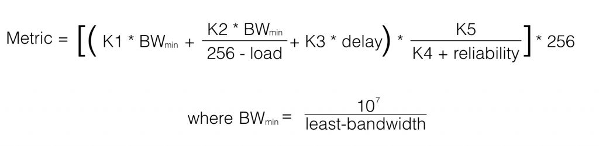

# Introducción
Enhanced Interior Gateway Routing protocol.

Métrica **[[Ruteo Dinámico#Métricas|vector distancia]]** con algunas características de **link-state**.

Soporta múltiples protocolos ruteados.
Maneja VLSM.

**IPv4:** 224.0.0.10
**IPv6:** ff02::a

Número de Protocolo 88

## Distancias administrativas
Tiene 3 distancias administrativas
|Modo|Distancia Administrativa|
|-|:-:|
|Internal|90
|External|170|
|Sumarizada|5|

## Sucesores
- **Sucesor:** Es la mejor ruta al destino y será colocada en la tabla de ruteo.
- **Posible Sucesor:** Ruta de respaldo hacia el destino, almacenada en la tabla topológica.

Si no está disponible el sucesor, el posible sucesor tomará su lugar en la tabla de ruteo.

## Paquetes
- Hello
- Actualizaciones
- Consultas
- Respuestas
- Solicitudes

## Configuración Básica EIGRP
1 es el [[Ruteo Dinámico#Sistema Autónomo|sistema autónomo]]
```
Router(config)#router eigrp 1
```
ID de red y wildcard
```
Router(config)#network 172.16.16.0 0.0.0.255
```

## Sistema Autónomo
Grupo de redes de direcciones IP, gestionadas por uno o mas operadores de red que poseen una política de ruteo única.

Representa un pool de direcciones bajo una sola política de ruteo.

# Paquetes EIGRP
## Hello
- Se usa para descubrir vecinos y crear adyacencias con los mismos.
	- Se envían por multicast y utiliza **RTP poco confiable** 
	- Se envían cada 5 segundos por multicast (en la mayoría de las redes)
		- En algunas redes con ancho de banda menor (redes T1), se envían mediant unicast cada 60 segundos.
	- Después de 15 segundos (3 veces el tiempo de hello) se declara al destino inalcanzable.
		- Se ejecuta DUAL de nuevo para encontrar una nueva ruta.
  
## Update
- Propagan información de routing solo cuando es necesario (hay un cambio en la topología).
	- No se envían periódicamente.
	- Usan **RTP de entrega confiable**
 
## Acknowledgement
- Acuse que el paquete fue recibido
	- Usa **RTP poco confiable**
 
## Query
Se usa cuando busca redes y realiza otras tareas.

**Usan RTP confiable**

## Reply
Contestación a un paquete **query**
Usa **RTP confiable**.

# Funcionamiento

1. Se envían Hello para establecer y mantener adyacencias con vecinos.
	1. Cuando un router recibe un Hello, agrega a ese router a su tabla de vecinos.
	2. Requerimientos
		1. Deben usar los mismos parámetros de métrica de EIGRP
		2. Deben tener el mismo sistema autónomo
3. Después de recibir un hello (después del ACK), envía una actualización y un hello.
4. Se envían actualizaciones entre sí, actualizando su tabla de ruteo con la mejor ruta.
 
## Algoritmo de Actualización Difusa (DUAL)
Constituye el centro del protocolo de routing, garantiza rutas de respaldo sin rutas.

Al usar DUAL EIGRP almacena todas las rutas de respaldo disponibles a los destinos, así se puede adaptar rápidamente a rutas alternativas si es necesario.

## Adyacencias
EIGRP establece relaciones con routers conectados directamente que también están habilitados para EIGRP. 

Las adyacencias de vecinos se usan para rastrear el estado de los vecinos.

## Protocolo de transporte confiable (RTP)
Es exclusivo de EIGRP y se encarga de la entrega de paquetes confiables (efectivamente reemplazando a TCP).

EIGRP es agnóstico del protocolo de capa de red, por lo que no utiliza TCP ni UDP.

**RTP confiable** require acuse de recibo
**RTP poco confiable** no requiere acuse de recibo

## Actualizaciones Parciales y Limitadas
Las actualizaciones EIGRP utilizan los términos "parcial" y "limitada".

EIGRP no envía actualizaciones periódica, las entradas de ruta no vencen.

### Parcial
Significa que la actualización solo incluye información acerca de cambios de ruta, como nuevo enlace o un enlace que deja de estar disponible.

### Limitada
La propagación de las actualizaciones parciales enviados a los routers que se ven afectados por un cambio.

## Balanceo de Carga de Mismo Costo o con Distinto Costo
EIGRP permite balanceo de carga de mismo o distinto costo. Esto permite distribuir mejor el tráfico en la red.

## Módulos dependientes de protocolo (PDM)
Son módulos independientes que permiten que EIGRP fucione con diferentes protocolos como IPv4 e IPv6.

Para esto, se tienen 2 de cada tipo de tabla:
- Tabla de Vecinos IPv4
- Tabla de Vecinos IPv6
- Tabla de topología IPv4
- Tabla de topología IPv6
- Tabla de ruteo IPv4
- Tabla de ruteo IPv6

Cada PDM son responsables de las tareas específicas de routing de cada protocolo de capa de red.

- Mantener tablas actualizadas
- Traducir del protocolo para DUAL

## Encapsulación
0x001 parámetros EIGRP
0x0102 Ruts internas
!!!!

# Métrica
Está determinada por 2 parámetros por defecto y 2 opcionales.

Estos parámetros son considerados los valores **K**.

## Parámetros por Defecto
### Bandwidth
El menor ancho de banda en la ruta entre origen y destino expresado en kilobits por segundo.

### Delay
Delay que acumulan todas las interfaces a lo largo de la ruta al destino, expresado en decenas de microsegundos.

Es la suma de los retardos a lo largo de una ruta dividido entre 10.

## Parámetros Opcionales
### Reliability
Representa el tramo menos confiable en la ruta entre origen y destino, tomando como base los keepalives.

### Load
Representa el enlace con mayor carga en la ruta entre origen y destino, tomando como base la tasa de paquetes y el ancho de banda configurado en las interfaces.

## MTU (K5)
Unidad máxima de transferencia, por defecto 1500, ya que es el tamaño de una trama ethernet.

Actualmente hay modificaciones en las que se envían paquetes más grandes.

Actualmente no se considera tanto el MTU, pero se mantiene por cuestiones históricas (compatibilidad con el protocolo IGP).

## Constantes K
Los valores predeterminados de las constantes K son:
K1 = 1
K2 = 0
K3 = 1
K4 = 0
K5 = 0

## Formula Métrica


## Comandos de Métrica

### Verificar valores
Con el comando 
```
R1# show interfaces <interface>
```

Podemos obtener todos los valores de la interfaz que se están considerando para calcular la métrica.

Para ver lo valores K, podemos usar el comando
```
R1# show ip protocols
```

### Cambiar valores K
```
R1(config)# router eigrp <AS>
R1(config-router)# metric weights k1 k2 k3 k4 k5
```

Los valores K de todos los routers adyacentes deben ser los mismos.

### Modificar ancho de banda

```
R1(config)# interface <int>
R1(config)# bandwidth <bw>
```
No es recomendable modificar el ancho de banda ya que afecta el QoS, se recomienda modificar el Delay en su lugar.

### Modificar el Delay
```
R1(config)# interface <int>
R1(config-if)# delay <delay
```